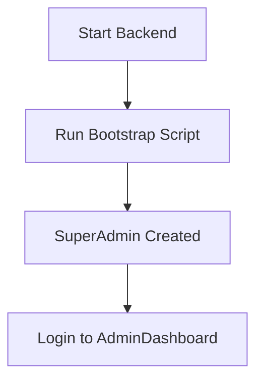
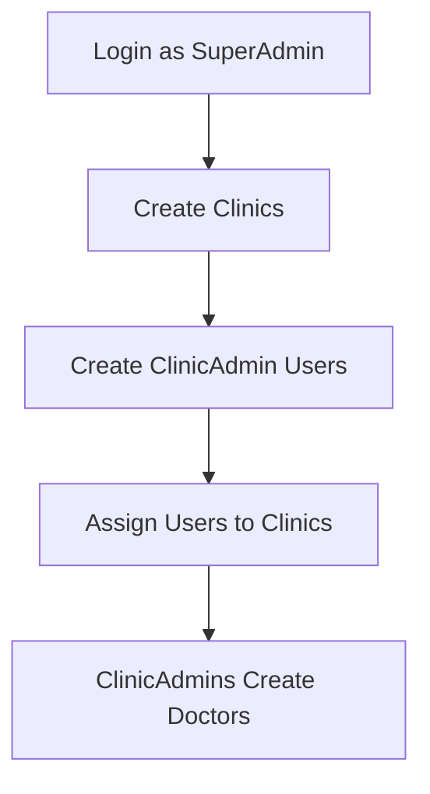
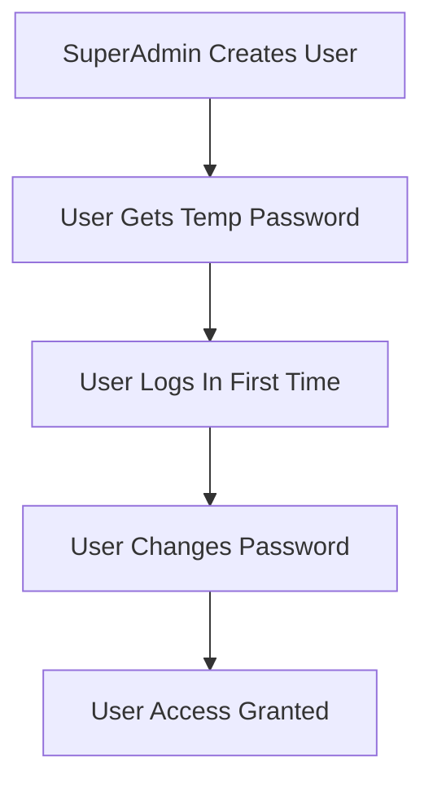

# HairAI Admin Setup Guide

This guide explains how to create and manage admin accounts in the HairAI platform.

## 🚀 Quick Start

### Step 1: Start the Backend

```bash
cd Backend
dotnet run --project HairAI.Api
```

### Step 2: Bootstrap First SuperAdmin

Choose one of these methods:

#### Option A: Using the Bootstrap Script (Recommended)

```bash
# On Windows
scripts\bootstrap-admin.bat

# On Linux/Mac
./scripts/bootstrap-admin.sh
```

#### Option B: Manual API Call

```bash
curl -X POST http://localhost:5000/auth/bootstrap-admin
```

#### Option C: Using Postman/HTTP Client

```http
POST http://localhost:5000/auth/bootstrap-admin
Content-Type: application/json
```

### Step 3: Login to AdminDashboard

1. Open: http://localhost:3001
2. Login with:
   - **Email:** `admin@hairai.com`
   - **Password:** `SuperAdmin123!`

## 🔐 Admin Account Management

### Creating Additional Admins

Once logged into the AdminDashboard:

1. **Navigate to Users** → Click "Users" in the sidebar
2. **Add New User** → Click "Add User" button
3. **Fill the Form:**
   - First Name, Last Name, Email
   - **Role:** SuperAdmin (for admin accounts)
   - **Clinic:** Leave empty for SuperAdmin
4. **Submit** → User gets auto-generated temporary password

### User Roles Explained

| Role            | Permissions                                      | Clinic Required |
| --------------- | ------------------------------------------------ | --------------- |
| **SuperAdmin**  | Full system access, can manage all users/clinics | No              |
| **ClinicAdmin** | Manage their clinic's users and patients         | Yes             |
| **Doctor**      | View/create analysis sessions for their clinic   | Yes             |

### Security Features

- ✅ **Bootstrap Protection:** Only works if no SuperAdmin exists
- ✅ **Self-Protection:** Can't delete/deactivate your own account
- ✅ **Role Validation:** Only SuperAdmins can create users
- ✅ **Temporary Passwords:** Auto-generated secure passwords for new users
- ✅ **Email Uniqueness:** No duplicate email addresses allowed

## 🏥 Complete Workflow

### 1. System Setup



### 2. Multi-Tenant Setup



### 3. User Creation Flow



## 📋 Default Credentials

### Bootstrap SuperAdmin

- **Email:** `admin@hairai.com`
- **Password:** `SuperAdmin123!`
- **Role:** SuperAdmin
- **Clinic:** None (system-wide access)

## 🛠️ Troubleshooting

### "SuperAdmin already exists" Error

- This means bootstrap was already run
- Login with: `admin@hairai.com` / `SuperAdmin123!`

### API Not Running

- Ensure backend is started: `cd Backend && dotnet run --project HairAI.Api`
- Check health endpoint: http://localhost:5000/health

### Can't Access AdminDashboard

- Ensure frontend is started: `cd Frontend/AdminDashboard && npm run dev`
- Check URL: http://localhost:3001

### Login Issues

- Verify credentials: `admin@hairai.com` / `SuperAdmin123!`
- Check browser console for errors
- Ensure backend database is migrated

## 🔄 Password Management

### For New Users

- System generates secure temporary passwords
- Users must change password on first login
- Passwords follow security requirements (length, complexity)

### For Existing Users

- Currently managed through Identity system
- Future enhancement: Password reset functionality via email

## 📊 Monitoring

### User Activity

- `LastLoginAt` field tracks user activity
- `CreatedAt` field shows when account was created
- `IsActive` field shows current status

### Audit Trail

- User creation/deletion events logged
- Role assignments tracked
- System access monitored

## 🔧 Advanced Configuration

### Custom Bootstrap Credentials

Modify `AuthController.cs` line 70-75 to change default admin credentials:

```csharp
var adminUser = new ApplicationUser
{
    Email = "your-admin@yourcompany.com",  // Change this
    UserName = "your-admin@yourcompany.com",
    FirstName = "Your",                    // Change this
    LastName = "Name",                     // Change this
    EmailConfirmed = true,
    ClinicId = null
};
```

### Environment-Specific Setup

Consider different admin accounts for:

- Development: `admin@hairai.dev`
- Staging: `admin@hairai.staging`
- Production: `admin@yourcompany.com`

## 🚨 Production Considerations

1. **Change Default Password** immediately after bootstrap
2. **Use Strong Passwords** for all admin accounts
3. **Limit SuperAdmin Accounts** to necessary personnel only
4. **Enable Logging** for admin actions
5. **Regular Backups** of user data
6. **SSL/HTTPS** for production deployments

## 📞 Support

If you encounter issues:

1. Check the troubleshooting section above
2. Review backend logs for errors
3. Verify database connectivity
4. Ensure all migrations are applied

